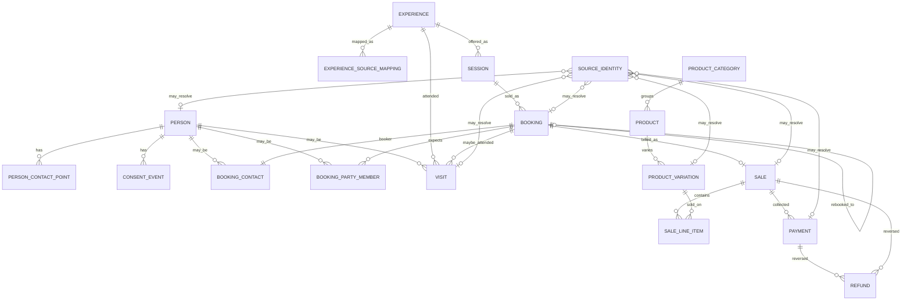

# Goat Barn proposed data model

Architecture for the Goat Barn business model. The **operational core** is implemented in PostgreSQL (migration `0002_operational_core`; see `docs/schema.md`). Financial tables (`sale` and related), PERSON, and consent are still design-only. FareHarbor `integration_events` remains the webhook inbox.

This proposal is based on:

- live Wherewolf audit (30-day window: 529 reservations, 1312 cropped guest records)
- FareHarbor Booking with Payments webhook schema and inbox design
- live Square audit (30-day window: 1090 orders, 1090 payments, 3 refunds; catalog 342 items / 1100 variations / 24 categories)
- existing `integration_events` identity columns (`provider`, `external_entity_type`, `external_entity_id`)

It is sized for a seasonal agritourism business, not a master-data platform.

---

## A. Goals and principles

1. **Internal UUIDs** for every canonical row. Provider IDs never become our primary keys.
2. **Source identities are first-class and may be unresolved.** A Square customer id, a Wherewolf guest id, or a FareHarbor `customers[].pk` can exist in `source_identity` with no `person` (or other canonical row) yet.
3. **PERSON is optional and sparse.** Do not auto-create people from Square customers, every FareHarbor party member, or every Wherewolf guest.
4. **Unknown and anonymous are valid.** Retail sales, child participants, and visits can exist without a PERSON.
5. **Do not collapse roles.** Booker ≠ participant. Participant ≠ visit. Square customer ≠ PERSON.
6. **Canonical financial document is SALE, not ORDER.** Square’s Order is a provider object. FareHarbor has a booking with receipts/payments, not a Square-shaped order. Counting `sale.total` and `payment.amount` together is not revenue.
7. **Source-specific facts live on the fact row.** Visit city stays on `visit`. Booker email stays on `booking_contact`. There is no generic person EAV table in the initial model. Raw snapshots/events keep the original payload.
8. **Raw evidence and normalized facts are separate.** `integration_events` is the FareHarbor webhook inbox. Pull APIs should keep snapshots later. Normalized tables are derived and idempotent.
9. **Historical facts survive rebooking and catalog archive.** Old bookings and archived Square items keep their UUIDs and source ids.
10. **Do not normalize** signatures, waiver blobs, IP addresses, card data, receipt URLs, full DOB, or full street address unless a later business need is explicit.

---

## B. Entity list

**Canonical (target model):**

| Entity | Why it exists |
| --- | --- |
| `source_identity` | Provider ids, including unresolved ones |
| `person` | Canonical human, often missing |
| `person_contact_point` | Email/phone for later matching (not Phase 1) |
| `consent_event` | Time-stamped consent changes (not Phase 1) |
| `experience` | Canonical Udderly offering (e.g. Goat Cuddles) |
| `experience_source_mapping` | FH item / WW activity / later Sanity |
| `session` | Dated occurrence (FH availability) |
| `booking` | FareHarbor booking |
| `booking_contact` | Booker |
| `booking_party_member` | Expected participant |
| `visit` | Actual attendance (Wherewolf) |
| `sale` | Commercial sale document (revenue accounting) |
| `sale_line_item` | Items sold |
| `payment` | Cash movement |
| `refund` | Reversal of a payment |
| `product_category` | Retail category |
| `product` | Retail item (including archived) |
| `product_variation` | Sellable SKU |

**Already exists (keep as-is):**

| Entity | Role |
| --- | --- |
| `integration_events` | Durable FareHarbor webhook inbox + payload hash idempotency |

**Deferred (not initial schema):**

| Entity / feature | Role |
| --- | --- |
| `booking_status_history` | Materialize webhook timeline only if reporting needs it; inbox already has history |
| `person_observation` | Rejected: no EAV. Facts stay on visit / booking_contact / etc. |
| `source_snapshot` | Pull-API JSONB copies of Wherewolf / Square / FH history |
| Canonical table named `order` | Rejected: Square-specific word; use `sale` |

**Deliberately omitted:** inventory ledgers, tax-rate dimensions, affiliate tables, Square Instant Profile as people, Mailchimp lists, Sanity as system of record, event sourcing every field.

---

## C. Entities

Primary key for every new canonical table: `id uuid`. Our clocks: `created_at`, `updated_at`. Provider times stored when useful (`occurred_at`, `observed_at`).

Money: integer **cents** + `currency` (`CAD` on Square; FareHarbor decimal strings converted at ingest).

### `source_identity`

**Purpose.** Registry of external ids. This is **not** only a join table for already-normalized rows.

A row is allowed with **no** canonical target:

```
provider = square
entity_type = customer
external_id = ABC123
internal_entity_type = null
internal_entity_id = null
```

Later, if that Square customer is resolved to a PERSON, fill `internal_entity_type = person` and `internal_entity_id = <uuid>`. Until then the id is still unique and queryable.

**Key fields**

- `provider` — `fareharbor` \| `wherewolf` \| `square` \| later `sanity` \| `mailchimp`
- `entity_type` — provider-native: `booking`, `booking_pk`, `guest`, `order`, `payment`, `customer`, `catalog_variation`, …
- `external_id` — text (stringify FareHarbor integer PKs)
- `internal_entity_type` — nullable
- `internal_entity_id` — nullable UUID
- `is_primary` — optional hint for the id used in upserts (FH `booking.uuid`, Square `order.id`)
- `observed_at`

**Uniqueness without requiring a canonical link**

- Unique constraint: **`(provider, entity_type, external_id)`** only.
- That uniqueness does **not** include internal ids, so unresolved rows do not collide and resolved rows do not need a second unique key on the external id.
- Optional later: unique `(internal_entity_type, internal_entity_id, provider, entity_type)` where internal ids are not null, if we want at most one identity of a given provider type per canonical row. Not required for Phase 1.
- Application rule: if both internal columns are set, they must be set together; if one is null, both are null.

**One external id → at most one registry row.** One canonical row → many source identities (FH uuid + pk; WW aliases; Square payment customer vs order customer).

**Do not** use Square `order.id` as our sale primary key. Map it: `provider=square`, `entity_type=order`, `internal_entity_type=sale` once the sale exists. FareHarbor has no equivalent “order id”; the experience sale is identified internally and linked from `booking`.

**Aliases / rebooking**

- FareHarbor: `entity_type=booking` (uuid) and `booking_pk` (pk) may both point at the same `booking` once created.
- Wherewolf reservation `aliases` → extra unresolved or booking-linked rows (`booking_alias`).
- Rebooking: new booking UUID/pk rows; old identities stay on the old booking.
- Square archived catalog: identity remains; `product.is_archived = true`.

**Hot-path copies:** Phase 1 does **not** copy FareHarbor `booking.uuid` onto `booking`. Look up via `source_identity`.

**PII:** no (ids only).

---

### `person`

**Purpose.** Sparse canonical human. Not created in Phase 1 ingest by default.

**Key fields:** `display_name` nullable, `match_status` (`unresolved` \| `partial` \| `resolved`), timestamps.

No email, phone, city, or consent columns.

**Source of truth:** none until a cautious link exists.

**PII:** yes if name is set.

---

### `person_contact_point` (deferred)

Email/phone observations for matching. Phase 1 stores booker/visitor contacts on `booking_contact` and `visit` instead.

When added: `person_id` nullable, `kind`, `raw_value`, `normalized_value`, `source_identity_id` nullable, `observed_at`. Same email from FH and WW remains two rows until `person_id` is shared.

---

### `consent_event` (deferred)

Consent **changes over time**. Not a boolean on `person`.

**Conceptual fields**

- `person_id` nullable
- `source_identity_id` nullable (and/or `provider` + entity)
- `channel` — `email` \| `sms` \| `unknown`
- `status` — `opt_in` \| `opt_out` \| `unknown`
- `source` — `wherewolf` \| `fareharbor` \| `mailchimp` \| …
- `source_field` — e.g. `marketing`, `smsOptIn`
- `occurred_at` — when the provider says it happened, if known
- `observed_at` — when we ingested it
- `provenance` — `integration_event_id` or future snapshot id

Wherewolf `marketing` (54.7% on cropped guests) and booking `smsOptIn` are separate events. Mailchimp later adds rows. Never overwrite.

Phase 1: leave flags on the fact (`visit.marketing_opt_in` / `booking_contact.sms_opt_in`) as **last-seen operational copies**, not a consent ledger. Promote to `consent_event` when we start matching people or Mailchimp.

---

### `experience`

Canonical Udderly offering. Not a FareHarbor item PK.

**Fields:** `name`, `status` (`active` \| `retired`).

**Source of truth:** Udderly. Mappings are evidence.

**PII:** no.

---

### `experience_source_mapping`

**Fields:** `experience_id`, `provider`, `provider_object_type` (`item` for FareHarbor, later `wherewolf_activity` \| `sanity_experience`), `external_id`, `external_label`. Unique `(provider, provider_object_type, external_id)`.

**Evidence:** FH `availability.item.pk` + name; WW `activitiesAsObjects.id` + name.

**PII:** no.

---

### `session`

Dated run of an experience (FH availability). Implemented columns: `experience_id`, `start_at` / `end_at`, `capacity`, `status`. FareHarbor availability maps later through `source_identity`.

Do not invent sessions from Wherewolf `tripTimeslot` strings. Store those on `visit`.

**Source of truth:** FareHarbor for bookable inventory. Wherewolf times describe attendance.

**PII:** no.

---

### `booking`

FareHarbor operational booking.

**Fields**

- FareHarbor booking UUID lives in `source_identity` (no convenience copy on `booking`)
- `status` — current FH status
- `booked_at` / provider created time
- `observed_at` — last ingest / webhook time
- `session_id`, `experience_id` nullable
- `party_size` — `customer_count`
- `source_type`, thin affiliate columns
- `cancelled_at`; cancellation reason **prefer inbox** (may be PII)
- `rebooked_from_booking_id` / `rebooked_to_booking_id`
- `is_superseded` when rebooked onward
- `sale_id` nullable — the experience SALE, once created

**No `booking_status_history` in the initial schema.** Current status + timestamps + cancel/rebook FKs are enough. Full webhook payloads remain in `integration_events`. If a report later needs every status transition, materialize `booking_status_history` from the inbox.

**Money does not live on booking.** Receipt totals belong on `sale`.

**Source of truth:** FareHarbor. Wherewolf reservations are not canonical bookings.

**PII:** low on this row.

---

### `booking_contact`

The booker (Sarah), not the party.

**Fields:** `booking_id` unique, `person_id` nullable, last-seen `name`, `email`, `phone`, `sms_opt_in` (FH/WW booker-shaped flags).

Do not assume contact = `customers[0]`.

**Source of truth:** FareHarbor `contact`. Wherewolf reservation `customer` is booker-shaped if we ever attach it; still not the guest list.

**PII:** yes.

---

### `booking_party_member`

Someone **expected** to attend. One row per FH `customers[].pk` for that booking’s life (new PKs after rebooking).

**Fields:** `booking_id`, `source_identity_id` (FareHarbor customer, unresolved to PERSON), `customer_type`, `checkin_status` (hint only), `sequence`, `is_active`, `last_seen_at`, `removed_at`. Booking-scoped custom fields (e.g. “how did you hear”) can sit here as nullable columns if useful, else remain in the webhook payload.

**Source of truth:** FareHarbor `customers[]`. Not nested Wherewolf `bookings[].guests`.

**PII:** low unless custom fields are copied.

---

### `visit`

Someone who **actually attended** (Wherewolf cropped guest), not a booked slot.

**Fields**

- `person_id` nullable
- `experience_id` / `session_id` nullable
- `booking_id` nullable + `match_confidence` (`unmatched` \| `linked` \| `ambiguous`)
- `visited_at`
- `wherewolf_status`, `signed` (**boolean**, not signature blob)
- **Demographics (derived, not DOB):** `is_minor`, `age_at_visit` if we choose to compute at ingest, `age_band` (e.g. child / adult / unknown)
- **Geography as visit facts:** `city`, `postal` (not street)
- **Referral:** `where_did_you_hear` (WW 84.4%)
- `marketing_opt_in` last-seen from WW `marketing` until `consent_event` exists
- group context: `how_many_people` / `group_size` (not extra visit rows)

**Do not store:** DOB, IP, signature, guardian name (unless later justified), full address.

**Census:** use this table (cropped guests). Nested reservation guests were **1422** vs **1312** cropped records — not 1:1.

Walk-ins: `booking_id` null is valid.

**Source of truth:** Wherewolf cropped guest API.

**PII:** yes (city, postal, age band, optional email if copied for ops).

---

### `sale`

Provider-neutral **commercial sale document**. This is what revenue accounting reads.

- One FareHarbor booking **may** produce one `sale` (`kind=experience`).
- One Square Order **may** produce one `sale` (`kind=retail`). Square Order **id** is a `source_identity` (`entity_type=order`), not this table’s name or PK.

**Fields**

- `kind` — `experience` \| `retail`
- `booking_id` nullable (experience sales)
- `sold_at`, `status`
- `subtotal_cents`, `discount_cents`, `tax_cents`, `total_cents`
- `currency`
- **Do not store `amount_paid` on sale.** That is cash, and it duplicates `payment`. Omitting it makes `sale.total + payment.amount` an explicit mistake rather than a tempting column.

Tips: store on **`payment`** (Square `tip_money`). Do not add tips into `sale.total` unless finance later defines tax-in/tip-in document totals — default is merchandise/experience document **without** tip.

**Revenue vs cash (non-negotiable)**

| Metric | Sum |
| --- | --- |
| Revenue / sales mix | `sale.total_cents` (or `subtotal` if we adopt tax-exclusive reporting) |
| Cash collected | `payment.amount_cents` (and `payment.total_cents` if that includes tip) |
| Cash returned | `refund.amount_cents` |
| Net cash | payments − refunds |

Never: `SUM(sale.total) + SUM(payment.amount)`.  
Never: Square Order money + Square Payment money as two revenue lines.  
Never: FH `receipt_total` + FH `payments[].amount` as two revenue lines.

**Source of truth:** FH receipt fields for experience; Square Order (`net_amounts` / `total_money` — pick one definition at ingest and document it on the row or in code comments) for retail.

**PII:** no.

Rebooking: old sale remains; new booking gets a new sale.

---

### `sale_line_item`

**Fields:** `sale_id`, `product_variation_id` nullable (retail; Square `catalog_object_id` is a variation in 3390/3392 lines), `experience_id` nullable, sold `name` / `variation_name`, `quantity` (may be fractional), `gross_cents`, `discount_cents`, `tax_cents`, `total_cents`.

Experience sales may have a single line. Do not copy Square line `note` (possible PII).

**PII:** no (product names are business data).

---

### `payment`

Cash movement / tender. **Not revenue.**

**Fields:** `sale_id`, `amount_cents`, `tip_cents`, `total_cents`, `processing_fee_cents`, `method` (`card` \| `cash` \| `external` \| `unknown`), `status`, `paid_at`.

Square `customer.id` on a payment → `source_identity` (often **unresolved**). Do not create PERSON.

**Source of truth:** Square Payments API; FH `payments[]`.

**PII:** no if card details, last4, fingerprints, receipt URLs are omitted (they exist on Square; strip at ingest even in snapshots if possible).

---

### `refund`

Reversal of a **payment** (and therefore of cash against a sale).

**Fields:** `payment_id`, `sale_id`, `amount_cents`, `status`, `refunded_at`. No free-text reason.

**Evidence:** Square 3/30 days, all with payment_id and order_id.

**PII:** no.

---

### `product_category` / `product` / `product_variation`

Square Catalog. `product.is_archived` for the 159/342 archived items — still resolvable historically. SKU on variation (87.3%). Category names as observed (Cheese, Ice Cream, Alpaca Merchandise, Event*, `UR Experiences`, …).

Square catalog object ids via `source_identity`. `catalog_version` is not our PK.

**PII:** no.

---

## D. ER diagram



`source_identity` is optional-to-canonical (open diamond): unresolved Square customers and similar have no internal FK.

`person`, `person_contact_point`, and `consent_event` are in the target model; they are not Phase 1 tables.

`integration_events` remains the FareHarbor raw inbox and is not a booking.

---

## E. Source-system mapping matrix

| Canonical | FareHarbor | Wherewolf | Square |
| --- | --- | --- | --- |
| `source_identity` | `booking.uuid`, `booking.pk`, `customers[].pk`, `availability.pk`, `item.pk`, `payments[].pk`, `refunds[].pk` | `guest.id`, reservation `id` / `displayId` / `reservationsID` / `aliases`, activity id | `order.id`, `payment.id`, `refund.id`, `customer.id` (usually unresolved), catalog ids, `location.id` |
| `person` | Not automatic | Not automatic | **Never** automatic from `customer.id` |
| `booking` | **System of record** | Parallel reservation only | — |
| `booking_contact` | `contact` (+ last-seen email/phone/sms flag) | Reservation `customer` is booker-shaped | — |
| `booking_party_member` | `customers[]` | Nested guests **not** the party list | — |
| `session` | `availability` | Times on visit only | — |
| `experience` | `availability.item` | `activitiesAsObjects` | Retail/event **products**, not experiences |
| `visit` | `checkin_status` hint | **System of record** + city/postal/age_band/referral | — |
| `sale` (experience) | Receipt totals on booking | `paid` string ignored | — |
| `sale` (retail) | — | — | Square **Order** as source identity → our `sale` |
| `payment` / `refund` | `payments[]` / `refunds[]` | — | Payments / refunds APIs |
| `product*` | — | — | ITEM / VARIATION / CATEGORY |
| Consent | Flags on contact until `consent_event` | `marketing` on visit until ledger | Segments ≠ consent |

---

## F. Identity-resolution strategy

Not implemented in Phase 1. Ingest facts and **unresolved** `source_identity` rows.

When matching is added:

1. Never merge on Square `customer.id` alone.
2. Never assume FareHarbor contact = each `customers[]` row.
3. Never assume Wherewolf guest = FareHarbor customer (1422 nested vs 1312 cropped vs FH party size).
4. Create `person` only for manual link or exact email/phone across two operational sources.
5. Default `person_id` null on party members, visits, payments.
6. No fuzzy city/name matching (London vs Woodstock stays as visit vs booker facts).
7. Square `reference_id` is unused (0%).

---

## G. Revenue-accounting strategy

Two streams: **experience `sale`** (FareHarbor) and **retail `sale`** (Square Order → sale).

| Question | Use |
| --- | --- |
| Gross / net sales | `sale` amounts only |
| Mix by product/experience | `sale_line_item` |
| Tenders | `payment.method` |
| Tips | `payment.tip_cents` (not farm merchandise unless finance says so) |
| Processing fees | `payment.processing_fee_cents` (cost) |
| Tax collected | `sale.tax_cents` (liability) |
| Discounts | `sale.discount_cents` / lines |
| Total Udderly sales | experience sales + retail sales (same `sale` definition) |

Exclude superseded/cancelled experience sales from “current revenue” as finance defines. Old rows remain.

Square 30-day: 1090 orders / 1090 payments / 3 refunds; use sale for mix, payment for cash.

---

## H. Attendance strategy

| Metric | Definition |
| --- | --- |
| Booked people | `booking.party_size` or `booking_party_member` count (live bookings) |
| Actual visitors | `visit` count |
| No-show hint | FH `checkin_status` |
| No-show join | Party member with no visit — **incomplete** |
| Walk-ins | `visit.booking_id` is null |

Do not census nested Wherewolf `bookings[].guests`. `pax` / `paxCompleted` is reservation occupancy, not a person list.

---

## I. Rebooking strategy

FH: rebooking replaces a booking. Keep uuid chain.

- B2 new booking; B1.`rebooked_to` = B2; B2.`rebooked_from` = B1; B1.`is_superseded` = true.
- New party members (new `customers[].pk`).
- New experience `sale` on B2; B1 sale retained.
- Source identities for B1 remain.
- Visits stay on the day they happened.

Webhook history of status changes stays in `integration_events`, not a history table.

---

## J. Raw-data / provenance strategy

**Now:** `integration_events` JSONB for FareHarbor Booking with Payments. Duplicates hashed. Indexed by provider + entity type + `booking.uuid`. Not exposed over HTTP.

**Later:** `source_snapshot` for Wherewolf/Square/FH history pulls. Strip card_details; treat full Wherewolf (signatures/photos) as higher sensitivity than cropped.

Normalized tables omit DOB, signatures, IP, cards, receipt URLs on purpose. Snapshots are how we re-derive or prove what the provider said.

---

## K. Open questions

**Do not block Phase 1 schema shape:** Square EXTERNAL mix, Instant Profile policy, nested vs cropped guest ops, Event/UR Experiences vs FH, MOBILE location, affiliate table vs columns.

**Should be decided before first money ingest (can ship schema with a documented default):**

1. Experience `sale.total` = FH `receipt_total` (tax-in) vs `receipt_subtotal` (tax-exclusive)?
2. Retail `sale.total` = Square `total_money` vs `net_amounts.total_money`?
3. Are Square tips included in retail `sale.total` or payment-only?
4. Cancellation reason on `booking` vs inbox-only?

**Should be decided before PERSON / consent_event:**

5. Guardian name: snapshot-only vs visit column.
6. Mailchimp join key (email contact points).
7. Compute `age_at_visit` at ingest from snapshot DOB (DOB still not stored on `visit`) vs age_band/is_minor only.

---

## PII / data classification

| Class | Examples | Normalized SQL |
| --- | --- | --- |
| Public business | Experience and product names, session times | Yes |
| Internal operational | Status, SKUs, party size, sale totals, check-in hint | Yes |
| PII | Booker name/email/phone; visit city/postal | On the **fact** (`booking_contact`, `visit`) |
| Sensitive PII | DOB, street address, guardian, IP, minors’ full identity | Snapshots / inbox only. On visit: `is_minor`, optional `age_band` / `age_at_visit` |
| Do not normalize | Signatures (still on WW **cropped**), waiver blobs, photos, cards/last4/fingerprints, billing address, receipt URLs, refund reason text, medical/passport WW fields | **No** |

---

## L. Phase 1 vs deferred

The first business-data migration created the **operational core only** (`0002_operational_core`). It does not ingest data.

### Implemented (operational core)

| Table | Why |
| --- | --- |
| `source_identity` | External ids, including unresolved |
| `experience` | Canonical offering |
| `experience_source_mapping` | Curated FH item / WW activity / later Sanity → experience (real FK) |
| `session` | Dated occurrence |
| `booking` | FH operational booking |
| `booking_contact` | Booker ≠ party |
| `booking_party_member` | Expected participants |
| `visit` | WW attendance facts |

`experience_source_mapping` is retained: it is the assignment of a provider catalog object to an `experience` with a PostgreSQL FK. `source_identity` is the id registry and may be unresolved; it cannot FK to `experience`. Do not also store FareHarbor item / Wherewolf activity mappings only in `source_identity`.

Keep using existing `integration_events`.

### Next schema migrations (not built)

| Table / feature | Why later |
| --- | --- |
| `sale`, `sale_line_item`, `payment`, `refund` | Financial core |
| `product_category`, `product`, `product_variation` | Square catalog |
| `person`, `person_contact_point` | Matching |
| `consent_event` | Consent ledger (last-seen flags already on visit/contact) |
| `booking_status_history` | Inbox already has webhook history |
| `source_snapshot` | Pull-API copies |
| Canonical `order` | Not in the model |

### Explicitly not this migration

Ingestion, FareHarbor/Wherewolf/Square normalization workers, identity matching, dashboards, PERSON creation.

---

Existing integrations stay unchanged. No production rows are inserted by the schema migration.
